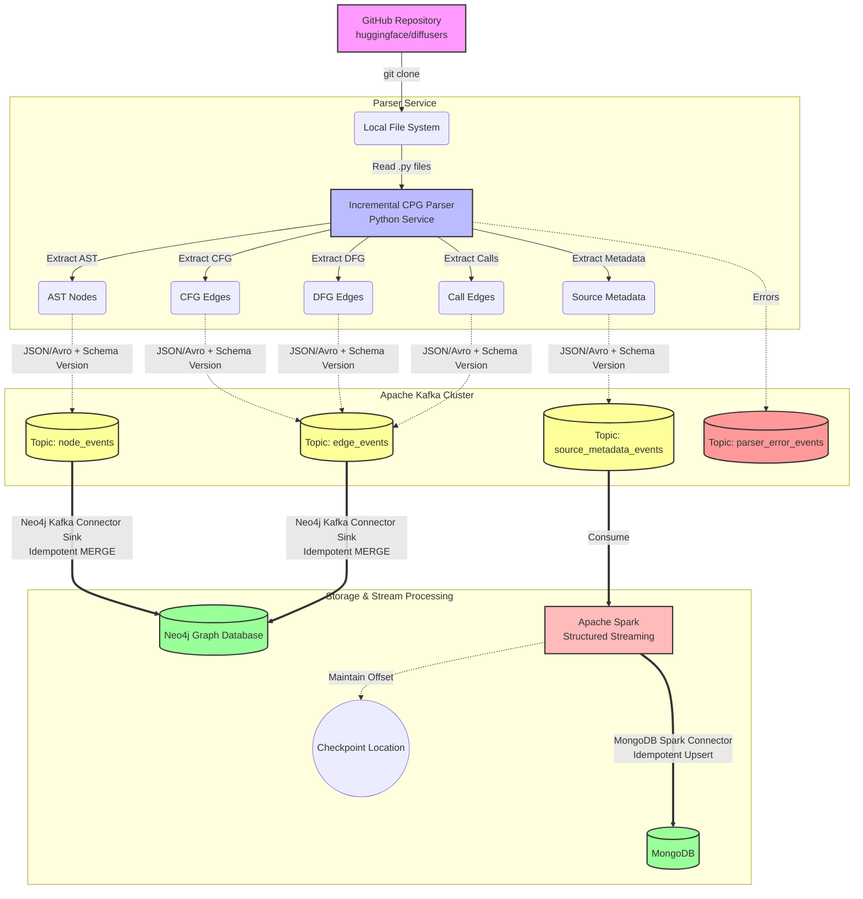

# Architecture Diagram cho Lab 04: Spark Streaming

Sơ đồ dưới đây mô tả luồng dữ liệu tổng thể của hệ thống từ lúc đọc mã nguồn đến khi lưu trữ vào cơ sở dữ liệu.

## Giải thích luồng dữ liệu:
1. **Source:** Mã nguồn được tải về từ GitHub.
2. **Parser Service:** Đọc tuần tự từng file Python, phân tích và trích xuất các thành phần đồ thị (Nodes, Edges) cùng với siêu dữ liệu (Metadata). Mỗi thành phần được gán một ID cố định (Stable ID).
3. **Kafka:** Hoạt động như một Message Broker trung tâm, nhận các sự kiện từ Parser Service và phân loại vào 4 topics khác nhau.
4. **Neo4j Ingestion:** Sử dụng Neo4j Kafka Connector Sink để hút dữ liệu trực tiếp từ các topic `node_events` và `edge_events`. Lệnh MERGE được sử dụng để đảm bảo tính Idempotent (không trùng lặp khi chạy lại).
5. **MongoDB Ingestion:** Apache Spark Structured Streaming đọc dữ liệu từ topic `source_metadata_events`, xử lý và lưu vào MongoDB thông qua MongoDB Spark Connector. Trạng thái đọc (offset) được lưu tại Checkpoint Location để có thể phục hồi khi có sự cố.
