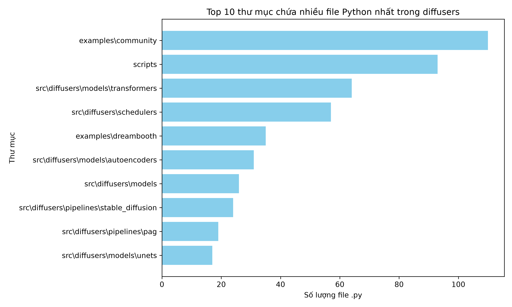
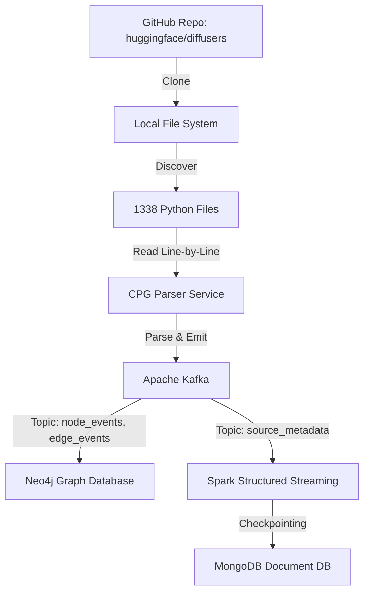

# Task 1: Repository Cloning and File Discovery

## Phương pháp đã chọn và lý do
Trong Task 1, mục tiêu là tải mã nguồn từ repository [huggingface/diffusers](https://github.com/huggingface/diffusers) và trích xuất danh sách các file Python cần phân tích. 
- Để tối ưu hóa băng thông và không gian lưu trữ, chúng tôi đã sử dụng lệnh:
  ```bash
  git clone --depth 1 https://github.com/huggingface/diffusers.git
  ```
  Lý do: Cờ (flag) `--depth 1` chỉ tải về commit mới nhất (shallow clone), giúp tiết kiệm thời gian đáng kể vì kho lưu trữ diffusers rất lớn với lịch sử commit dài.

- Sau khi có mã nguồn, thay vì dùng các lệnh bash thông thường, chúng tôi đã viết một script Python (`src/discovery/file_discovery.py`) để tìm kiếm. Script này cho phép lọc bỏ các thư mục không cần phân tích mã nguồn (như `tests`, `docs`, `utils`) một cách linh hoạt.

## Script File Discovery
Dưới đây là phần mã chính trong script Python đã được dùng để lọc và đếm các file `.py`:

```python
import os
import glob

def find_python_files(repo_path):
    excluded_dirs = ['tests', 'docs', 'utils']
    excluded_files = ['setup.py']
    
    python_files = []
    
    for root, dirs, files in os.walk(repo_path):
        dirs[:] = [d for d in dirs if d not in excluded_dirs and not d.startswith('.')]
        for file in files:
            if file.endswith('.py') and file not in excluded_files:
                full_path = os.path.join(root, file)
                python_files.append(full_path)
                
    return python_files
```

## Kết quả trung gian
Quá trình chạy script đã cho ra kết quả xuất sắc khi loại bỏ được lượng lớn file rác và test, chỉ giữ lại source code lõi.

```text
Đang duyệt thư mục 'diffusers' để tìm các file Python...

Tổng số file Python tìm thấy: 1338

Danh sách 10 file đầu tiên:
 - diffusers\src\diffusers\configuration_utils.py
 - diffusers\src\diffusers\dependency_versions_table.py
 - diffusers\src\diffusers\dummy_flax_and_transformers_objects.py
 - diffusers\src\diffusers\dummy_flax_objects.py
 ... (và nhiều file khác)

Đã lưu danh sách toàn bộ file vào 'src/discovery/python_files_list.txt'
```

Biểu đồ phân bố số lượng file Python theo từng thư mục con:


## Sơ đồ Kiến trúc (Architecture)
Để làm rõ luồng dữ liệu cho toàn bộ hệ thống (dựa theo Task 7), dưới đây là sơ đồ Architecture Diagram tổng quát:



## Reflection (Phản ngẫm)
- **Những gì hiệu quả**: Việc áp dụng shallow clone và viết Python Script với `os.walk` diễn ra rất trơn tru, giúp tiết kiệm thời gian filter file thủ công trên hệ thống lớn.
- **Những gì thất bại**: Ban đầu, chúng tôi chưa cấu hình loại bỏ thư mục `utils` và file `setup.py`, điều này làm nhiễu danh sách dữ liệu.
- **Cách giải quyết**: Đã tinh chỉnh lại script filter logic bằng cách update mảng `excluded_dirs` và `excluded_files`, chạy lại một cách mượt mà và chốt lại con số 1338 file thực sự cần parse.
