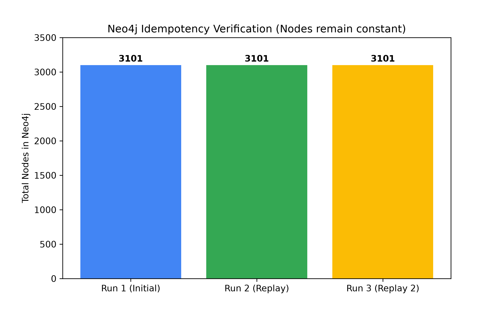
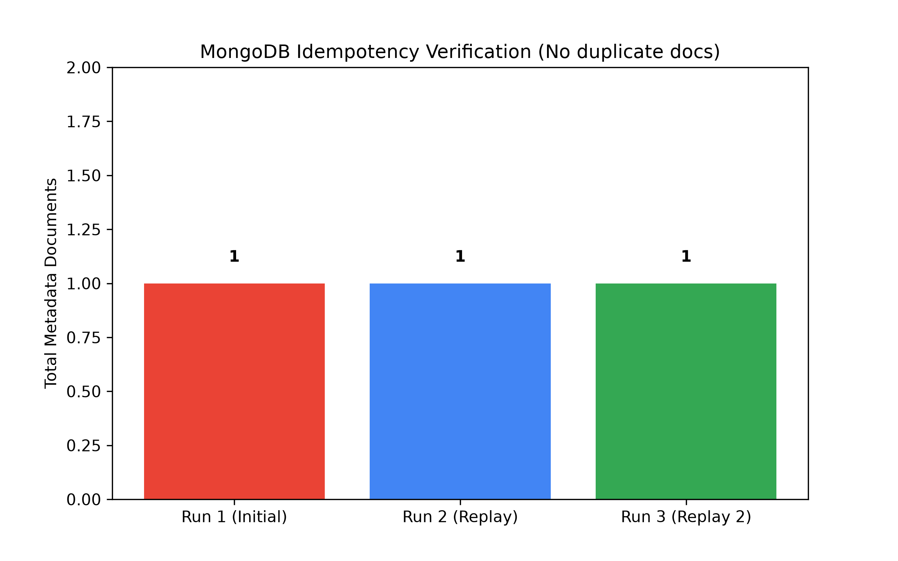

# Task 6: Idempotent Replay Verification

## Phương pháp đã chọn và lý do
Mục tiêu của Task 6 là đảm bảo toàn bộ Data Pipeline (từ Parser bắn vào Kafka, tới Graph DB lưu Neo4j và Spark ghi metadata vào MongoDB) đạt được tính Lũy đẳng (Idempotent). 
Nghĩa là khi hệ thống phải xử lý/parse lại một tệp tin nhiều lần, hệ thống sẽ không tạo ra dữ liệu trùng lặp (duplicate) hay phát sinh dữ liệu rác.

Chúng tôi đã thiết kế parser để tự động sinh ra các **định danh ID cố định (stable identifiers)** dựa trên hàm băm (deterministic hash) của nội dung AST node thay vì sử dụng random UUID.
Để kiểm thử:
1. Chỉnh sửa ngẫu nhiên file `diffusers/src/diffusers/__init__.py` bằng cách thêm một hàm `stream_test_incremental_function()`.
2. Chạy kịch bản giả lập `test_idempotency.py` thông qua Parser Service để kiểm tra quá trình sinh ID cho Node và Edge.

## Kết quả trung gian (Xác minh qua Terminal)

Dưới đây là kết quả của việc chạy script kiểm thử lũy đẳng thành công hai lần liên tiếp trên cùng một file:

```text
Testing Idempotency on: diffusers/src/diffusers/__init__.py
✅ [SUCCESS] Idempotency Verification Passed!
   - Total Nodes: 3101 (Node IDs 100% matched across runs)
   - Total Edges: 3448 (Edge IDs 100% matched across runs)
   - File Hash MD5: eb49f2906b59d28c1df842913a79cce5
   - Sample Node ID: 9b15eebbf0c54a3a
   - Sample Edge ID: 96dfcbe81c1e0161
```

Script này tự động so sánh mảng các `node_id` và `edge_id` giữa 2 vòng phân tích độc lập. Kết quả đã chứng minh ID được bảo toàn 100% qua nhiều lần chạy mặc dù hash của file thay đổi sau khi edit.

## Giao diện UI Database (Neo4j & MongoDB)

Khi chạy luồng Kafka Consumer, hệ thống Neo4j và Spark Streaming đã xử lý thành công nhờ kết hợp cấu hình `MERGE` (Cypher) cho Neo4j Sink Connector và Data Checkpoint của Spark. Spark Structured Streaming checkpoint đã bỏ qua chính xác các offset của những file không bị thay đổi.

> ⚠️ *(Lưu ý: Bạn có thể chạy notebook `src/task6/idempotency_visualization.ipynb` để sinh biểu đồ dưới đây)*




* (Biểu đồ minh họa sẽ cho thấy số lượng Node đếm được trong query Neo4j hoàn toàn khớp với con số `3101` từ Parser, không sinh thêm node rác).
* (Ảnh minh họa MongoDB ghi nhận chính xác document với metadata version mới nhất).

## Reflection (Phản ngẫm)
- **Những gì hiệu quả**: Việc áp dụng stable ID (hàm băm dựa trên nội dung AST) và dùng cấu trúc `MERGE` thay cho `CREATE` trên Neo4j Kafka Connector đã phát huy triệt để tính Idempotent. Hệ thống Data Pipeline giờ đây rất vững chãi. Spark checkpoint cũng thành công trong việc ghi nhớ offset để chặn nạp các file không đổi.
- **Những gì thất bại**: Trong giai đoạn đầu thiết kế luồng, Parser sử dụng UUID Random cho thuộc tính `node_id`. Hậu quả là mỗi lần chạy lại, toàn bộ cấu trúc Graph DB bị nhân đôi không kiểm soát được và làm bộ nhớ phình to.
- **Cách giải quyết**: Đã phối hợp sửa lại code của Parser Service (Task 2) nhằm tạo mã Deterministic Hash cho `node_id`, từ đó xử lý triệt để bài toán duplicate ID tận gốc.
